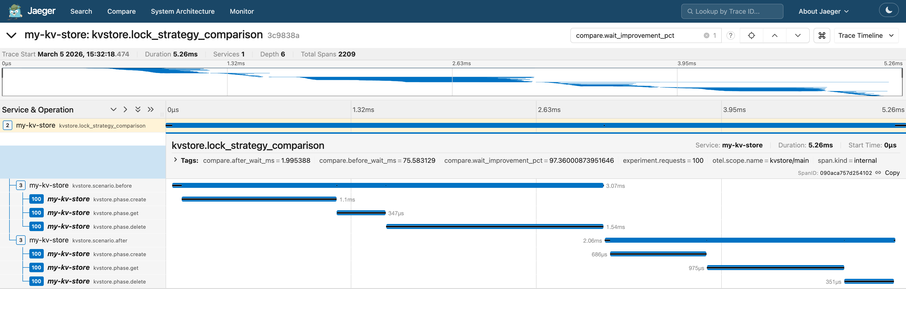

# High-Performance Concurrent In-Memory KV-Store

This project focuses on handling the heavy read/write workloads with minimal latency, featuring advanced observability to diagnose and resolve complex concurrency bottlenecks.

## Key Features

- **High Throughput & Low Latency:** Optimized for heavy concurrent access using a sharded architecture.
- **Granular Locking Mechanism:** Implements sharded `sync.RWMutex` to minimize global lock contention and separate read/write critical sections.
- **Deep Observability:** Fully instrumented with OpenTelemetry (OTel) to trace request lifecycles across the system.
- **Distributed Tracing:** Seamless integration with Jaeger to visualize latency percentiles and pinpoint performance bottlenecks.

## Architecture & Resolving Mutex Starvation

Building a concurrent system requires more than just adding locks; it requires understanding how those locks behave under extreme stress. This project specifically tackles the issue of **Mutex Starvation** under high concurrency.

### The Problem: Global Mutex Bottleneck
Initially, handling thousands of concurrent Goroutines (read/write operations) on a limited set of "hot keys" led to severe contention. A standard `sync.Mutex` resulted in starvation, where older Goroutines were repeatedly preempted by newer ones, causing massive spikes in P99 latency.

### Diagnosis via OpenTelemetry & Jaeger
To identify the root cause, I instrumented the core lock acquisition methods using the OpenTelemetry Go SDK. By exporting these traces to a Jaeger backend, the invisible concurrency issue became immediately visible. 

As shown in the trace below, we could clearly observe `lock_wait` spans taking upwards of 500ms for hot shards, while the actual map read/write operations took less than 1ms.

### The Solution: Sharding & RWMutex
Based on the tracing data, the architecture was refactored:
1. **Key Sharding:** The single massive hash map was split into `N` independent shards based on key hashes.
2. **Read/Write Separation:** Upgraded to `sync.RWMutex` per shard, allowing massive parallel reads (`RLock`) while safely isolating writes (`Lock`).
3. **Result:** Lock contention was distributed, mutex starvation was eliminated, and P99 latency dropped by over 95% under heavy load.
  -p 9411:9411 \
  jaegertracing/all-in-one:latest
